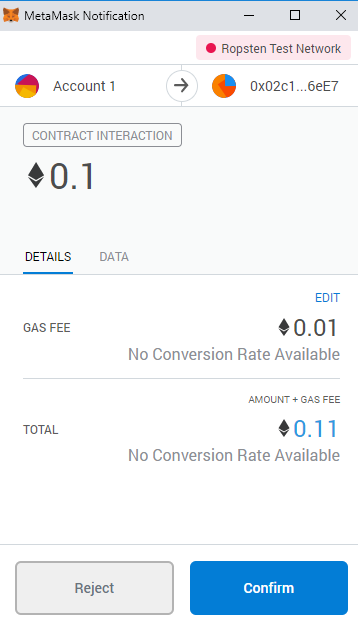

# SheepCoin

---
## Introduction
SheepCoin is a ERC20-compliant crypto-token deployed to the Ropsten testnet.\
Name: SheepCoin\
Ticker: SC\
Total Supply: 100000\
Decimals: 0 (You cannot own a fraction of 1 SheepCoin)\

Validate at [Etherscan](https://ropsten.etherscan.io/)\
SheepCoin contract address: 0x8540bb493e34a0aa72c9a4b7965cd8bf6b8af13e\
SheepCoinSale contract address (for ICO): 0x02c1c91b172cbab203d985c9caa7e7c4ee016ee7\

---
## What are ERC20 tokens?
ERC20 is a technical standard for token implementation on the Ethereum blockchain (mainnet and testnets). ERC20-compliant tokens can be exchanged as transactions on the Ethereum blockchain and stored in crypto-wallets.

---
## What is an ICO?
In the world of cryptocurrencies, an ICO *(Initial Coin Offering)* is analogous to an IPO *(Initial Public Offereing)* of a newly listed company at a stock exchange. ICOs are held by organisations to start a new cryptocurrency or raise funds.
**Check out our ICO website and buy SheepCoin using fake ether (it won't cost you anything) [here](https://ng223.github.io/SheepCoin/)**

---
## Instructions to buy SheepCoin
 1. Install and Add (and Pin) the Metamask extension to your browser\
..i) Go to https://metamask.io/ -> Download -> Select *browser* and click on 'Install Metamask for *browser*'.

..ii) Create (or Import) a Wallet

 2. Go to https://faucet.ropsten.be/

 3. Click on the Metamask extension (fox logo) icon in your browser\
..i) Connect to the Ropsten Test network.

..ii) Copy your account address and paste it in the faucet search box -> Click in 'Send me test Ether'. This shall deposit 1 test Ether in your account - You can use it on the Ropsten testnet.

 4. Go to https://ng223.github.io/SheepCoin/
 ..i) Click on 'Connect' when Metamask sends a notification like this:

 ..ii) Check the exchange rate and enter the number of SheepCoins to buy -> Click on 'Buy Tokens'.

 ..iii) Click on 'Confirm' after the Metamask confirmation tab pops up and voila! You now own SheepCoins.

 5. Click on the Metamask extension (fox logo) icon in your browser -> Menu -> (Scroll down) Click on 'Add token' -> Select 'Custom Token' tab -> Enter the SheepCoin contract address (mentioned in the introduction section of README.md) -> Click 'Next'.

 6. _\
 ..i) You can now see your SheepCoin balance in the 'Menu' after clicking on the Metamask extension (fox logo) icon in your browser.  

 ..ii) And you can send SheepCoin to others as transactions using their addresses.

---

**Huge shoutout to Gregory from Dapp University. You are a terrific mentor mate! :P**
